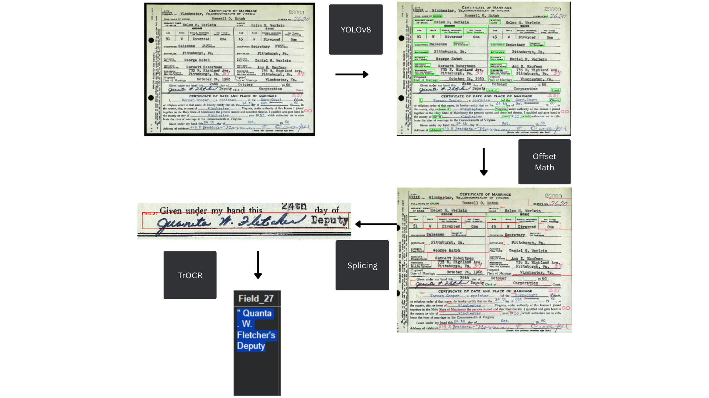

# Honors-Project
# Streamlining Ancestry: A Lightweight Document Processing Pipeline for Historical Document Data Extraction 

**Honors Research Project focused on utilizing Deep Learning practices to create systems to quickly extract data from historical documents of one format (Marriage, Birth, Death).**

## Abstract
The rise in popularity of digital genealogical li-
braries has brought a complexity to image databases. Records
are harder to search and require indexing. We propose a pipeline
to quickly extract data from scanned documents. This pipeline
is transferable to many document formats and requires minimal
manual labor to train the system. Our pipeline utilizes YOLOv8
for object detection and EasyOCR and TrOCR for optical
character recognition. The YOLOv8 model is trained to recognize
consistent machine printed fields which act as anchors for regions
of interest. Our YOLOv8 model achieved a mAP50 of .995, our
EasyOCR model achived a CRA of 85.4%, and our TrOCR
model achieved a disappointing CRA of 17.16%. This research
has concluded that cursive handwriting is difficult to recognize
especially in instances where data extends into other fields. We
conclude the paper by addressing the balance between data
privacy and public accessibility and the responsibilities entrusted
to users of this technology.

## Key Features

- **Accuracy**: Identifies one document format with a high level accuracy
- **Undemanding**: Requires 15-20 pieces of labeled data to train
- **Identify Consistant Area Around ROI**: YOLOv8-based detection of unchanging, recognizable location neighboring meaningful text regions (names, dates, places)
- **End-to-End Pipeline**: Complete workflow from raw document images to structured text extraction
- **Replicable**: Easily replicable to quickly create a model that will recognize a new document format

## Architecture

```
Input Document → YOLOv8 Detection → Gather Offset with Anchor Based Reference Math → OCR models → Structured Output
```

**Detection Model**: Ultralytics YOLOv8 for ROI identification  
**Recognition Model**: easyOCR and TrOCR (Transformer based Optical Character Recognition)
**Output**: Extracted text is entered into csv files which can be easily fed into web databases

## Dataset

- **Primary Dataset**: Virginia Marriage Documents October 1960 
- **Augmentation**: Built in YOLO data augmentation with the exception of fliplr and scale
- **Annotation**: manually labeled data using bounding boxes via annotation script

*Note: Dataset availability and access instructions will be updated based on privacy requirements.*

## Results

### Performance Metrics
- Detection Accuracy (mAP50): 99.5% 
- Recognition Accuracy: 85.4% CRA 58.99% WRA 

### Sample Outputs


## Technical Contributions

This work extends existing document processing research with the following novel contributions:

1. **Complete Pipeline**: Combining multiple Neural Networks to solve this problem
2. **Undemanding**: Requiring only 15-20 pieces of labeled data 
3. **Replicability**: Model can be used to recognize any document type to process mass amounts of documents very quickly

## Related Work

This project builds upon the foundational research by Dr. Nishat Majid in Offline Handwritting Recognition. Key differences and extensions:
- Increased Computing Power
- Recent Industry Inovations
- Completing the OCR pipeline

## Citation

If you use this work in your research, please cite:

```bibtex

```

## Acknowledgments

- Dr. Nishat Majid for foundational research and guidance
- Ohio Dominican University Honors Program
- Roboflow for data management platform
- Ultralytics for YOLOv8 framework

## Contact

Merrick Shorter - shorterm@ohiodominican.edu  
Linkedin URL - https://www.linkedin.com/in/merrick-shorter/

---
*This project was completed as part of an Honors Research Program at Ohio Dominican University under the supervision of Dr. Nishat Majid.*


